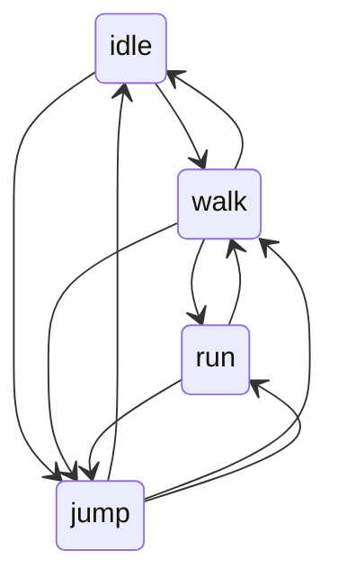

# General Testing Examples

## Test Objectives
Test objectives are what you actually want to validate/verify. These objectives are going to be context dependant: your application, whether you are doing QA or QC work, and the limitations present in your working conditions, will ultimately determine what your test objectives are. Because these objectives are context dependant, different general testing strategies will be conditionally useful for different test objectives

## Decision Table
Decision Tables are a helpful way of organizing your test data and your expected test outcomes. They can be simple and just list the inputs and outputs of your test, or you can expand them out to be as all encompassing as a resource like a Requirements Traceability Matrix

### Simple Decision Table
|username | expected result|
|--------|-----------------|
|Usern0me| account created|
|Us3rn| account created|
|Us3rn0meeeeeeee| account created|
| Us3r | account not created|
| Us3rn0meeeeeeeee| account not created|
|Username | account not created|
|usern0me | account not created |
|USERN0ME| account not created|

### Complex Decision Table
|username | expected result| tester assigned| actual results | notes |
|--------|-----------------|----------------|----------------|-------|
|Usern0me| account created| Billy | in progress | |
|Us3rn| account created| Billy | passed | |
|Us3rn0meeeeeeee| account created| Billy | Failed | registration appears to be non-inclusive at upper bound|
| Us3r | account not created|
| Us3rn0meeeeeeeee| account not created|
|Username | account not created|
|usern0me | account not created |
|USERN0ME| account not created|

## Conditional Testing
Conditional Testing is a way of organizing your test data based upon the conditions created during the test. Sticking with the registration example we could do something like the following:
- Positive
    - username valid -> "Account created successfully"
- Negative
    - username too long -> "Username is too long"
    - username too short -> "Username is too short"
    - not enough required characters -> "Username does not include all required characters

## Checklist Testing
Checklist Testing is putting together a check-list and going item by item validating each item on the list. This kind of organization for testing is very common in manual testing. Example
- Step 1: open registration page
- Step 2: enter username
- Step 3: submit credentials for registration
- Step 4: validate correct message is received

## State Transition Diagram
Anytime you are dealing with a feature or resource that has state considerations you can use a state transition diagram to help track what tests you need to create based upon the acceptable transitions between possible states

With this diagram in place you now know what your positive need to cover: all valid transitions should have a positive test to validate they work as intended. For each invalid transition (think idle to run in the example above) a negative test could be created to validate that state transition is not allowed

## Data Driven Testing
Data Driven Testing is where you store your test data in 3rd party location and then inject it into your tests at runtime. For instance, Junit has a feature that lets you link 3rd party data (like from a csv) and then inject that data into your tests at run time. Using the registration data as our example, there are 8 rows of data, some positive, some negative: if we were to use Junit's importing features to inject that data into a test class with a single function, that function would execute 8 times: once for each row of data, using the new test data in each row for each individual execution.